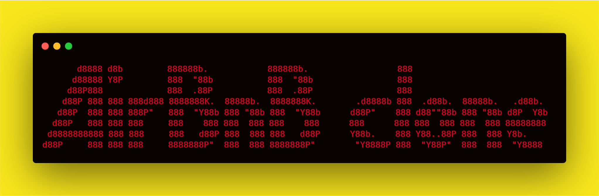

#
# AirBnB Clone  
### The Console + RESTful API + Front End Web Dynamic
An Airbnb clone is a complete full-stack web application with an administration
console and DevOps utilities, developed on Linux, Python, MySQL database, and
Flask RESTful API with a dynamic HTML5/CSS3/jQuery front-end.


The console is the first segment of the AirBnB project at Holberton School that
will collectively cover fundamental concepts of higher level programming. The
goal of AirBnB project is to eventually deploy our server a simple copy of the
AirBnB Website(HBnB). A command interpreter is created in this segment to manage
objects for the AirBnB(HBnB) website. The database MySQL is supported and Python
Flask is implemented for the RESTful API and Front end from the Back end with
JavaScript for dynamics.

#### Functionalities of this command interpreter:
* Create a new object (ex: a new User or a new Place)
* Retrieve an object from a file, a database etc...
* Do operations on objects (count, compute stats, etc...)
* Update attributes of an object
* Destroy an object
* Front end generated from the back end
* RESTful API from the back end

## Table of Content
* [Stack](#stack)
* [Context](#context)
* [Requirements](#requirements)
* [Installation](#installation)
* [Usage](#usage)
* [File Descriptions](#file-descriptions)
* [Examples of use](#examples-of-use)
* [Bugs](#bugs)
* [Authors](#authors)
* [License](#license)

## Stack
This project is interpreted/tested on:
- Linux, Ubuntu 14.04 LTS
- MySQL 5.7 (version 5.7.x)
- Python3 (version 3.4.3)
- Flask
- Jinja
- HTML 5 / CSS 3
- JavaScript

## Context


## Requirements
#### Back-end
To install and run the software it is necessary to have the next software and
packages installed:
- linux, ubuntu (version 14.04 LTS)
- mysql  Ver 14.14 Distrib 5.7.8-rc, for Linux (x86_64)
- python (version 3.4.3)
- pip 1.5.4 from /usr/lib/python3/dist-packages (python 3.4)  
  Packages for python:
  - flasgger (0.9.4)
  - Flask (1.1.2)
  - Jinja2 (2.11.2)
  - Flask-Cors (3.0.8)
  - lxml (3.3.3)
  - SQLAlchemy (1.2.5)

You can deploy the software in either:
- A physical machine  
  The operating system should be the Ubuntu 14.04 LTS with the software stack
  above installed.
- Or a virtual machine  
  You can create a virtual machine as an option. This solution has been tested
  on:
  - Virtual Box (version 6.0.10)
  - Vagrant 2.2.5  

Whether physical or virtual machine you should have the software and versions
above listed.

#### Front-end
To interpret the software you need a browser. This should be Chrome (version 57.0)
or compatible.

## Installation
First at all, the software:
* Clone this repository: `git clone "https://github.com/gogomillan/AirBnB_clone_v4.git"`
* Access AirBnb directory: `cd AirBnB_clone_v4`

Now you can see the files and directories of the project!!

Second, the data:
* Acces the assets directory: `cd assets`
* Copy the json file: `cp file.json ..`
* Restore data into mysql: `cat 100-dump.sql | mysql -uroot -p`
* Return to home: `cd ..`

Now you have data to work!!

## Usage
**For the console**
* Access AirBnb directory: `cd AirBnB_clone_v4`
* Run hbnb(interactively): `./console` and enter command
* Run hbnb(non-interactively): `echo "<command>" | ./console.py`

**For the API (lunching)**
* Access AirBnb directory: `cd AirBnB_clone_v4`
```bash wrap
guillaume@ubuntu:~/AirBnB_v3$ HBNB_MYSQL_USER=hbnb_dev HBNB_MYSQL_PWD=hbnb_dev_pwd HBNB_MYSQL_HOST=localhost HBNB_MYSQL_DB=hbnb_dev_db HBNB_TYPE_STORAGE=db HBNB_API_HOST=0.0.0.0 HBNB_API_PORT=5000 python3 -m api.v1.app
 * Running on http://0.0.0.0:5000/ (Press CTRL+C to quit)
...
```

**For the API (verify)**
* Access AirBnb directory: `cd AirBnB_clone_v4`
```bash wrap
guillaume@ubuntu:~/AirBnB_v3$ curl -X GET http://0.0.0.0:5000/api/v1/status
{
  "status": "OK"
}
guillaume@ubuntu:~/AirBnB_v3$
guillaume@ubuntu:~/AirBnB_v3$ curl -X GET -s http://0.0.0.0:5000/api/v1/status -vvv 2>&1 | grep Content-Type
< Content-Type: application/json
guillaume@ubuntu:~/AirBnB_v3$
```

## File Descriptions
[console.py](console.py) - the console contains the entry point of the command interpreter. 
List of commands this console current supports:
* `EOF` - exits console 
* `quit` - exits console
* `<emptyline>` - overwrites default emptyline method and does nothing
* `create` - Creates a new instance of`BaseModel`, saves it (to the JSON file) and prints the id
* `destroy` - Deletes an instance based on the class name and id (save the change into the JSON file). 
* `show` - Prints the string representation of an instance based on the class name and id.
* `all` - Prints all string representation of all instances based or not on the class name. 
* `update` - Updates an instance based on the class name and id by adding or updating attribute (save the change into the JSON file). 

#### `models/` directory contains classes used for this project:
[base_model.py](/models/base_model.py) - The BaseModel class from which future classes will be derived
* `def __init__(self, *args, **kwargs)` - Initialization of the base model
* `def __str__(self)` - String representation of the BaseModel class
* `def save(self)` - Updates the attribute `updated_at` with the current datetime
* `def to_dict(self)` - returns a dictionary containing all keys/values of the instance

Classes inherited from Base Model:
* [amenity.py](/models/amenity.py)
* [city.py](/models/city.py)
* [place.py](/models/place.py)
* [review.py](/models/review.py)
* [state.py](/models/state.py)
* [user.py](/models/user.py)

## Content Descriptions
[console.py](console.py) - the console (class HBNBCommand), contains the entry point of the command interpreter.
List of commands this console current supports:
* `EOF` - exits console                                                                                                                   * `quit` - exits console
* `<emptyline>` - overwrites default emptyline method and does nothing
* `create` - Creates a new instance of`BaseModel`, saves it (to the JSON file) and prints the id
* `destroy` - Deletes an instance based on the class name and id (save the change into the JSON file).
* `show` - Prints the string representation of an instance based on the class name and id.
* `all` - Prints all string representation of all instances based or not on the class name.
* `update` - Updates an instance based on the class name and id by adding or updating attribute (save the change into the JSON file).

#### `models/` directory contains classes used for the model of this project:
[base_model.py](/models/base_model.py) - The BaseModel class from which future classes will be derived
* `def __init__(self, *args, **kwargs)` - Initialization of the base model
* `def __str__(self)` - String representation of the BaseModel class
* `def save(self)` - Updates the attribute `updated_at` with the current datetime
* `def to_dict(self)` - returns a dictionary containing all keys/values of the instance

Classes inherited from Base Model:
* [amenity.py](/models/amenity.py) - Amenity
* [city.py](/models/city.py) - City
* [place.py](/models/place.py) - Places
* [review.py](/models/review.py) - Review
* [state.py](/models/state.py) - State
* [user.py](/models/user.py) - User

#### `/models/engine` directory contains File Storage class that handles JSON serialization and deserialization and database access:
[file_storage.py](/models/engine/file_storage.py) - serializes instances to a JSON file & deserializes back to instances
* `def all(self)` - returns the dictionary __objects
* `def new(self, obj)` - sets in __objects the obj with key <obj class name>.id
* `def save(self)` - serializes __objects to the JSON file (path: __file_path)
* `def reload(self)` - deserializes the JSON file to __objects
* `def get(self, cls, id)` - returns the object based on the class name and its ID, or None if not found.
* `def count(self, cls=None)` - returns the number of objects in storage matching the given class name. If no name is passed, returns the count of all objects in storage.

[db_storage.py](/models/engine/db_storage.py) - stores info into database
* `def all(self)` - returns the dictionary __objects
* `def new(self, obj)` - sets in __objects the obj with key <obj class name>.id
* `def save(self)` - stores __objects to the database (MySQL)
* `def reload(self)` - retrieve from the database to __objects
* `def get(self, cls, id)` - returns the object based on the class name and its ID, or None if not found.
* `def count(self, cls=None)` - returns the number of objects in storage matching the given class name. If no name is passed, returns the count of all objects in storage.

#### `/tests` directory contains all unit test cases for this project:
[/test_models/test_base_model.py](/tests/test_models/test_base_model.py) - Contains the TestBaseModel and TestBaseModelDocs classes
TestBaseModelDocs class:
* `def setUpClass(cls)`- Set up for the doc tests
* `def test_pep8_conformance_base_model(self)` - Test that models/base_model.py conforms to PEP8
* `def test_pep8_conformance_test_base_model(self)` - Test that tests/test_models/test_base_model.py conforms to PEP8
* `def test_bm_module_docstring(self)` - Test for the base_model.py module docstring
* `def test_bm_class_docstring(self)` - Test for the BaseModel class docstring
* `def test_bm_func_docstrings(self)` - Test for the presence of docstrings in BaseModel methods

TestBaseModel class:
* `def test_is_base_model(self)` - Test that the instatiation of a BaseModel works
* `def test_created_at_instantiation(self)` - Test created_at is a pub. instance attribute of type datetime
* `def test_updated_at_instantiation(self)` - Test updated_at is a pub. instance attribute of type datetime
* `def test_diff_datetime_objs(self)` - Test that two BaseModel instances have different datetime objects

[/test_models/test_amenity.py](/tests/test_models/test_amenity.py) - Contains the TestAmenityDocs class:
* `def setUpClass(cls)` - Set up for the doc tests
* `def test_pep8_conformance_amenity(self)` - Test that models/amenity.py conforms to PEP8
* `def test_pep8_conformance_test_amenity(self)` - Test that tests/test_models/test_amenity.py conforms to PEP8
* `def test_amenity_module_docstring(self)` - Test for the amenity.py module docstring
* `def test_amenity_class_docstring(self)` - Test for the Amenity class docstring

[/test_models/test_city.py](/tests/test_models/test_city.py) - Contains the TestCityDocs class:
* `def setUpClass(cls)` - Set up for the doc tests
* `def test_pep8_conformance_city(self)` - Test that models/city.py conforms to PEP8
* `def test_pep8_conformance_test_city(self)` - Test that tests/test_models/test_city.py conforms to PEP8
* `def test_city_module_docstring(self)` - Test for the city.py module docstring
* `def test_city_class_docstring(self)` - Test for the City class docstring

[/test_models/test_file_storage.py](/tests/test_models/test_file_storage.py) - Contains the TestFileStorageDocs class:
* `def setUpClass(cls)` - Set up for the doc tests
* `def test_pep8_conformance_file_storage(self)` - Test that models/file_storage.py conforms to PEP8
* `def test_pep8_conformance_test_file_storage(self)` - Test that tests/test_models/test_file_storage.py conforms to PEP8
* `def test_file_storage_module_docstring(self)` - Test for the file_storage.py module docstring
* `def test_file_storage_class_docstring(self)` - Test for the FileStorage class docstring

[/test_models/test_place.py](/tests/test_models/test_place.py) - Contains the TestPlaceDoc class:
* `def setUpClass(cls)` - Set up for the doc tests
* `def test_pep8_conformance_place(self)` - Test that models/place.py conforms to PEP8.
* `def test_pep8_conformance_test_place(self)` - Test that tests/test_models/test_place.py conforms to PEP8.
* `def test_place_module_docstring(self)` - Test for the place.py module docstring
* `def test_place_class_docstring(self)` - Test for the Place class docstring

[/test_models/test_review.py](/tests/test_models/test_review.py) - Contains the TestReviewDocs class:
* `def setUpClass(cls)` - Set up for the doc tests
* `def test_pep8_conformance_review(self)` - Test that models/review.py conforms to PEP8
* `def test_pep8_conformance_test_review(self)` - Test that tests/test_models/test_review.py conforms to PEP8
* `def test_review_module_docstring(self)` - Test for the review.py module docstring
* `def test_review_class_docstring(self)` - Test for the Review class docstring

[/test_models/state.py](/tests/test_models/test_state.py) - Contains the TestStateDocs class:
* `def setUpClass(cls)` - Set up for the doc tests
* `def test_pep8_conformance_state(self)` - Test that models/state.py conforms to PEP8
* `def test_pep8_conformance_test_state(self)` - Test that tests/test_models/test_state.py conforms to PEP8
* `def test_state_module_docstring(self)` - Test for the state.py module docstring
* `def test_state_class_docstring(self)` - Test for the State class docstring

[/test_models/user.py](/tests/test_models/test_user.py) - Contains the TestUserDocs class:
* `def setUpClass(cls)` - Set up for the doc tests
* `def test_pep8_conformance_user(self)` - Test that models/user.py conforms to PEP8
* `def test_pep8_conformance_test_user(self)` - Test that tests/test_models/test_user.py conforms to PEP8
* `def test_user_module_docstring(self)` - Test for the user.py module docstring
* `def test_user_class_docstring(self)` - Test for the User class docstring

#### `web_flask/` directory contains classes used for front-end from the back-end of this project:

#### `api/v1/` directory contains classes used for the REST API v1 of this project:
* [app.py](/api/v1/app.py) - Flask API v1 code base for the `app` and blueprint `app_views`

#### `api/v1/views` directory contains the views for the REST API v1 of this project:
Views from the app
* [amenities.py](/api/v1/views/amenities.py)
* [cities.py](/api/v1/views/cities.py)
* [index.py](/api/v1/views/index.py)
* [places.py](/api/v1/views/places.py)
* [places_reviews.py](/api/v1/views/places_reviews.py)
* [states.py](/api/v1/views/states.py)
* [users.py](/api/v1/views/users.py)

## Examples of use

**Example for the console**
```
vagrantAirBnB_clone$./console.py
(hbnb) help

Documented commands (type help <topic>):
========================================
EOF  all  create  destroy  help  quit  show  update

(hbnb) all MyModel
** class doesn't exist **
(hbnb) create BaseModel
7da56403-cc45-4f1c-ad32-bfafeb2bb050
(hbnb) all BaseModel
[[BaseModel] (7da56403-cc45-4f1c-ad32-bfafeb2bb050) {'updated_at': datetime.datetime(2017, 9, 28, 9, 50, 46, 772167), 'id': '7da56403-cc45-4f1c-ad32-bfafeb2bb050', 'created_at': datetime.datetime(2017, 9, 28, 9, 50, 46, 772123)}]
(hbnb) show BaseModel 7da56403-cc45-4f1c-ad32-bfafeb2bb050
[BaseModel] (7da56403-cc45-4f1c-ad32-bfafeb2bb050) {'updated_at': datetime.datetime(2017, 9, 28, 9, 50, 46, 772167), 'id': '7da56403-cc45-4f1c-ad32-bfafeb2bb050', 'created_at': datetime.datetime(2017, 9, 28, 9, 50, 46, 772123)}
(hbnb) destroy BaseModel 7da56403-cc45-4f1c-ad32-bfafeb2bb050
(hbnb) show BaseModel 7da56403-cc45-4f1c-ad32-bfafeb2bb050
** no instance found **
(hbnb) quit
```

**Example for the API**
```bash wrap
guillaume@ubuntu:~/AirBnB_v3$ curl -X GET http://0.0.0.0:5000/api/v1/states/8f165686-c98d-46d9-87d9-d6059ade2d99
 {
  "__class__": "State",
  "created_at": "2017-04-14T00:00:02",
  "id": "8f165686-c98d-46d9-87d9-d6059ade2d99",
  "name": "Louisiana",
  "updated_at": "2017-04-14T00:00:02"
}
guillaume@ubuntu:~/AirBnB_v3$
```

## Bugs
No known bugs at this time. 

## Authors
#### First part of Airbnb:
Alexa Orrico - [Github](https://github.com/alexaorrico) / [Twitter](https://twitter.com/alexa_orrico)  
Jennifer Huang - [Github](https://github.com/jhuang10123) / [Twitter](https://twitter.com/earthtojhuang)  
#### Second part of Airbnb:
Joann Vuong
#### Third part of Airbnb:
Jhoan Zamora - [Github](https://github.com/jzamora5) / [Twitter](https://twitter.com/JhoanZamora10)  
David Ovalle - [Github](https://github.com/Nukemenonai) / [Twitter](https://twitter.com/disartDave)  
#### Fourth part of Airbnb:
Gonzalo Gomez Millan - [Github](https://github.com/gogomillan) / [Twitter](https://twitter.com/gogomillan)  
Juan Marcos Cabezas - [Github](https://github.com/juanmarcoscabezas) / [Twitter](https://twitter.com/juanmarcab)  

## License
GLP-3.0 [License File](LICENSE)
